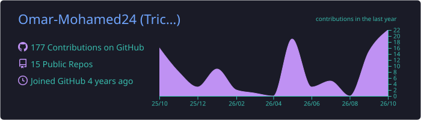
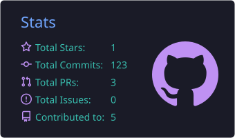
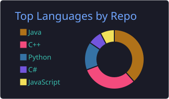

# Hi there, I'm Omar Mohamed 👋

### Backend & Full‑Stack Software Engineer · Competitive Programmer

---

## 🧑‍💻 About Me

- 🎓 **Computer Science graduate** from **Cairo University** — Faculty of Computers and Artificial Intelligence
- ⚙️ I specialize in **backend and full‑stack development**: microservices, RESTful APIs, and LLM‑integrated applications
- 🧠 Strong algorithmic foundation — **1000+ problems solved** on Codeforces & LeetCode, **Expert** rank on Codeforces
- 🤖 Previously a **Prompt Engineer at Scale AI (Outlier)**, optimizing prompts and evaluating model outputs
- 🚀 Currently seeking a **software engineering role** building scalable, reliable backend systems
- 🌍 Arabic (Native) · English (Advanced)

---

## 🛠️ Tech Stack

**Languages**

**Frameworks & Libraries**

**Databases & Storage**

**Tools & DevOps**

| Area | Skills |
|---|---|
| 🏗️ **Architecture** | Microservices · REST APIs · Software Architecture · Design Patterns · SOLID · OOP |
| 🤖 **AI & LLM** | LLM Integration · MCP (Model Context Protocol) · Stability AI · Prompt Engineering |
| 🐳 **DevOps** | Docker · Docker Compose · MinIO (Object Storage) · CI/CD |
| 🧪 **Quality** | Unit Testing · Data Structures & Algorithms |

---

## 🚀 Featured Projects

### 🎮 [GameForge](https://github.com/Omar-Mohamed24) — AI‑Powered Game Generation Platform
*Graduation Project*

Type a sentence, get a **playable Godot 4 HTML5 game**.

- 🧩 **10‑service microservices architecture** — REST backend, HTTP orchestrator, LLM‑driven planner and asset services, and a deterministic code‑assembly + Godot build pipeline
- 🧠 **LLM planner** that classifies prompts into game archetypes and fills a validated `GamePlan` JSON, with retry & fallback logic
- 🎨 **MCP‑based asset service** using Stability AI for sprites, backgrounds, and music
- 🔧 **Fragment‑based GDScript assembler** validated through the Godot CLI
- 🐳 Fully containerized with **Docker Compose** — object storage, database, and inter‑service auth

---

## 💼 Experience

**Prompt Engineer** — *Scale AI (Outlier)* · May 2024 – Nov 2024
- Designed and optimized AI prompts to improve NLP tasks, collaborating with cross‑functional teams
- Ran rigorous testing and analysis to ensure accurate, contextually relevant model outputs

---

## 📊 GitHub Stats

  
  
  
  

---

### 🤝 Let's connect!

I'm open to software engineering opportunities — feel free to reach out.

